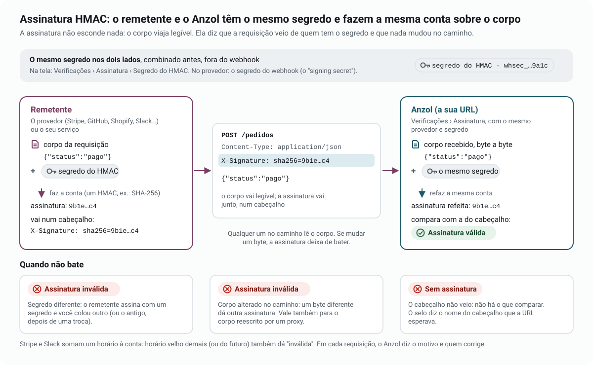
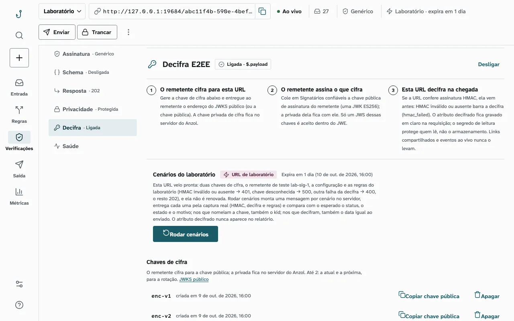
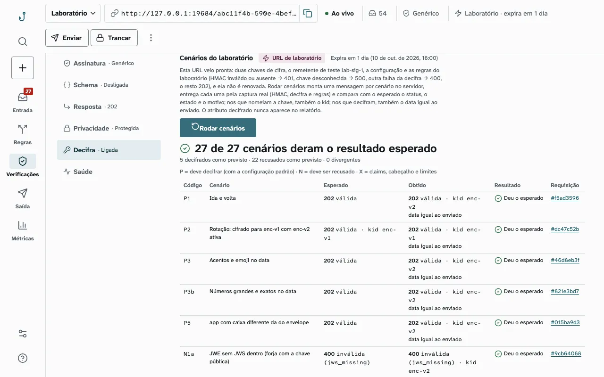
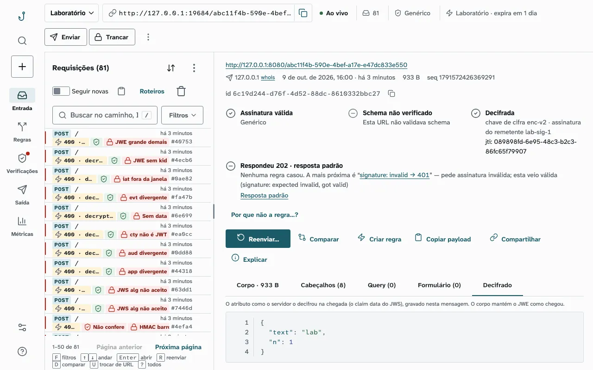

# Anzol

O Anzol gera uma URL que grava toda requisição HTTP recebida e a mostra na tela em tempo real, com regras de resposta,
verificação de assinatura, validação de schema, decifra de atributo e injeção de falhas. Serve para testar e depurar
webhooks e clientes HTTP na sua máquina, sem expor um servidor à internet (*anzol* é “fishhook” em português).

<picture>
  <source media="(prefers-color-scheme: dark)" srcset="docs/imagens/entrada-escuro.webp">
  
</picture>

## Início rápido

Precisa só de Docker com Compose. Clone, suba e abra a tela:

```bash
git clone https://github.com/isdiegoalves/anzol.git
cd anzol
docker compose up --build -d    # a primeira vez constrói a imagem e leva alguns minutos
```

Abra <http://localhost:8084>: a tela cria uma URL para você. Tudo o que chegar em `http://localhost:8084/<uuid>/…`
aparece na hora. O primeiro webhook, com o `<uuid>` da sua URL:

```bash
curl -X POST http://localhost:8084/<uuid>/pedidos -H 'Content-Type: application/json' -d '{"status":"pago"}'
```

A requisição aparece na Entrada com método, caminho, cabeçalhos e corpo. Daí: **Regras** escolhe o que a URL
responde; **Verificações** liga a assinatura, o schema, a decifra e o segredo de leitura; **Saída** reenvia para o seu
app; **Métricas** resume.

Os dados ficam no volume `anzol_redis-data` e sobrevivem a `docker compose down` (só `down -v` os apaga). Lá ficam
em claro os segredos HMAC, as chaves privadas de cifra e os valores decifrados: trate o volume e o backup como segredo.
Esse compose liga também o MCP, a IA local e a saída para a rede local, e por isso publica a porta só em
`127.0.0.1`; para publicar o app, veja [Configuração](docs/operacao.md#configuração).

### Imagem pronta (atalho)

Sem clonar, com a imagem publicada no GHCR (amd64 e arm64):

```bash
docker network create anzol
docker run -d --name anzol-db --network anzol -v anzol-db:/data redis:8.10.2-alpine \
  redis-server --maxmemory 1gb --maxmemory-policy noeviction
docker run -d --name anzol --network anzol -p 127.0.0.1:8084:8080 -e REDIS_HOST=anzol-db \
  ghcr.io/isdiegoalves/anzol:0.5.0
```

As tags (`X.Y.Z`, `X.Y`, `latest`) saem a cada versão em <https://github.com/isdiegoalves/anzol/pkgs/container/anzol>.
Assim, o MCP, a IA local e a saída para a rede local vêm desligados, o padrão do app.

## Como funciona

<picture>
  <source media="(prefers-color-scheme: dark)" srcset="docs/imagens/fluxo-geral-escuro.svg">
  
</picture>

Uma imagem só: o Spring Boot (Kotlin) serve a API, o tempo real e a tela (Angular) na mesma porta, e o Redis guarda as
URLs e as mensagens.

## O que ele faz

| O quê | Em uma linha | Detalhe |
|---|---|---|
| Captura em tempo real | Método, caminho, cabeçalhos, query e corpo de cada requisição, com busca, filtros e Compare | [API](docs/api.md) |
| Regras de resposta | Status, cabeçalhos e corpo por método, caminho, query, cabeçalho ou corpo; template e cenários (falha 2×, depois 200) | [Regras](docs/api.md#regras-de-resposta) |
| Injeção de falhas | Atraso, conexão reiniciada, conexão presa, corpo cortado, por sorteio e por janela de tempo; na entrega ao seu app, pela CLI ou pelo reenvio | [Falhas](docs/api.md#atrasos-e-falhas-de-rede) · [CLI](docs/cli.md#falhas-na-entrega-listen-e-replay) |
| Assinatura HMAC | Stripe, GitHub, Shopify, Slack e HMAC genérico (SHA-1, SHA-256, SHA-512), com o motivo de cada falha e quem corrige | [Assinatura](docs/api.md#verificação-de-assinatura) |
| Schema | JSON Schema 2020-12 em cada mensagem, usável nas regras | [Schema](docs/api.md#validação-de-schema) |
| Decifra de atributo (E2EE) | A URL abre um atributo cifrado pelo remetente e confere quem o assinou; laboratório com 27 cenários prontos | [Decifra](docs/api.md#decifra-de-atributo-e2ee) |
| Reenvio e envio pelo servidor | Reenvia uma mensagem para o seu app, com falha injetada se quiser, e guarda o histórico | [Reenvio](docs/api.md#reenvio-e-envio-pelo-servidor) |
| Esperar, buscar, estatísticas | `wait` para testes sem `sleep`; busca por texto e por condição; métricas por URL | [Esperar](docs/api.md#esperar-por-mensagens) |
| Privacidade | Segredo de leitura por URL, links só-leitura com máscara, captura isolada por CSP | [Privacidade](docs/privacidade.md) |
| CLI `anzol` | Entrega no app local, reenvio, regras como arquivo, webhooks assinados, teste de CI num comando | [CLI](docs/cli.md) |
| MCP e IA local | Agentes operam o Anzol por MCP; regra a partir de texto e explicação da mensagem com um LLM local | [MCP e IA](docs/mcp-e-ia.md) |

## Assinatura e decifra em português simples

Nenhuma das duas pede conhecimento de criptografia para usar. Abaixo, o que cada uma protege, quem faz o quê e por
onde começar na tela; o detalhe técnico fica em [`docs/api.md`](docs/api.md).

### Assinatura HMAC: “veio de quem eu espero, e ninguém mexeu”

O provedor e a sua URL guardam o mesmo segredo. A cada webhook, o provedor faz uma conta sobre o corpo com esse segredo
e manda o resultado, a assinatura, num cabeçalho. O Anzol refaz a mesma conta sobre o corpo que recebeu e compara:
igual, **Assinatura válida**; diferente, **Assinatura inválida**, com o motivo; sem o cabeçalho, **Sem assinatura**.
A assinatura não esconde nada: o corpo continua legível.

<picture>
  <source media="(prefers-color-scheme: dark)" srcset="docs/imagens/assinatura-hmac-escuro.svg">
  
</picture>

- **Quem faz o quê:** o provedor assina; você cola o segredo dele no Anzol; o Anzol confere cada requisição na chegada.
- **Por onde começar:** Verificações › Assinatura. Escolha o provedor (Stripe, GitHub, Shopify, Slack ou Genérico) e
  cole o segredo do HMAC; o cartão mostra onde a assinatura chega e o que é assinado em cada um. Para testar sem o
  provedor, “Mandar um teste assinado” na mesma tela, ou `anzol send --provider …`.
- **Detalhe:** fórmula de cada provedor, motivos e a comparação em tempo constante em
  [Verificação de assinatura](docs/api.md#verificação-de-assinatura).

### Decifra de atributo: “só o Anzol lê o conteúdo, e sabe quem o assinou”

O remetente assina um atributo do corpo com a chave privada dele e o cifra para a chave pública da sua URL: só a
chave privada da URL, que fica no servidor do Anzol, abre. O resto do corpo, o envelope, vai legível. O Anzol decifra
na chegada, confere a assinatura do remetente com a chave pública que você colou e confere que o que está assinado lá
dentro bate com o envelope. Deu certo, **Decifrada**, e o valor aparece na aba Decifrado para quem tem o segredo de
leitura da URL.

<picture>
  <source media="(prefers-color-scheme: dark)" srcset="docs/imagens/decifra-escuro.svg">
  
</picture>

- **Quem faz o quê:** o Anzol gera as chaves de cifra da URL (a pública vai ao remetente pelo JWKS; a privada fica no
  servidor). O remetente gera as chaves de assinatura dele (a privada fica com ele; a pública você cola em Signatários
  confiáveis). Se a URL verifica assinatura HMAC, ela é conferida antes da decifra.
- **Por onde começar:** Verificações › Decifra › “Criar uma URL de laboratório” e, nela, “Rodar cenários”: o servidor
  cria uma URL pronta, monta 27 mensagens (as que decifram e as que têm de ser recusadas) e mostra o resultado de cada
  uma, com link para a requisição. Depois, numa URL sua: gere a chave de cifra, cole a chave pública do remetente,
  diga qual atributo vem cifrado e os vínculos com o envelope, e ligue um segredo de leitura em Verificações ›
  Privacidade (a decifra exige um).
- **O que fica onde:** o valor decifrado fica gravado em claro no Redis; o segredo de leitura protege quem lê pela
  tela e pela API, não o armazenamento. Links só-leitura, eventos ao vivo e o MCP nunca levam o valor.
- **Detalhe:** o formato aceito (um JWE `ECDH-ES`/`A256GCM` com um JWS `ES256` dentro), os vínculos, a ordem das
  conferências e os motivos em [Decifra de atributo](docs/api.md#decifra-de-atributo-e2ee).

<details>
<summary>Telas</summary>

**Verificações › Assinatura**: HMAC genérico com SHA-512.

<picture>
  <source media="(prefers-color-scheme: dark)" srcset="docs/imagens/verificacoes-escuro.webp">
  
</picture>

**Verificações › Decifra**: a decifra ligada numa URL de laboratório.

<picture>
  <source media="(prefers-color-scheme: dark)" srcset="docs/imagens/decifra-escuro.webp">
  
</picture>

**Laboratório**: os 27 cenários depois de uma rodada.

<picture>
  <source media="(prefers-color-scheme: dark)" srcset="docs/imagens/laboratorio-escuro.webp">
  
</picture>

**Detalhe com decifra**: a mensagem decifrada e a aba Decifrado.

<picture>
  <source media="(prefers-color-scheme: dark)" srcset="docs/imagens/detalhe-decifra-escuro.webp">
  
</picture>

**Regras**: a regra em palavras e o editor, aqui com uma falha de rede por sorteio e janela.

<picture>
  <source media="(prefers-color-scheme: dark)" srcset="docs/imagens/regras-escuro.webp">
  
</picture>

**Reenviar com falha injetada**: atraso de 800 ms e envio em dobro.

<picture>
  <source media="(prefers-color-scheme: dark)" srcset="docs/imagens/reenviar-escuro.webp">
  
</picture>

**Saída**: o histórico do que o servidor mandou e o que foi injetado.

<picture>
  <source media="(prefers-color-scheme: dark)" srcset="docs/imagens/saida-escuro.webp">
  
</picture>

**Métricas** da URL.

<picture>
  <source media="(prefers-color-scheme: dark)" srcset="docs/imagens/metricas-escuro.webp">
  
</picture>

**No celular.**

<picture>
  <source media="(prefers-color-scheme: dark)" srcset="docs/imagens/entrada-celular-escuro.webp">
  
</picture>

</details>

## CLI, API e MCP

**CLI `anzol`** (roda em Java 21 ou mais novo; o build usa o JDK 25):

```bash
(cd cli && ./gradlew installDist) && export PATH="$PWD/cli/build/install/anzol/bin:$PATH"

anzol listen --forward http://localhost:3000                        # entrega no seu app o que chega na URL
anzol send --to http://localhost:3000/webhooks/github --provider github --secret s3gredo --data-file push.json
anzol test --method POST --path /pedidos --json-path '$.status=pago' -- ./dispara-pedido.sh {url}
```

O `anzol test` cria a URL, roda o comando que faz o seu app mandar o webhook, espera, confere e apaga a URL; a saída
diz ao CI se passou. Todos os comandos e opções em [`docs/cli.md`](docs/cli.md).

**API**: todas as rotas, os formatos e os erros em [`docs/api.md`](docs/api.md) e no documento OpenAPI 3.1 servido em
`/openapi.yaml` e `/openapi.json`; o contrato caixa-preta que as garante, em
[`tests/contract/README.md`](tests/contract/README.md).

**MCP**: com `ANZOL_MCP_ENABLED=true` (ligado no compose), o app é um servidor [MCP](https://modelcontextprotocol.io)
em `/mcp` com 18 ferramentas sobre a mesma API ([detalhes](docs/mcp-e-ia.md#mcp)):

```bash
claude mcp add --transport http anzol http://127.0.0.1:8084/mcp
```

### IA local

Com `ANZOL_AI_ENABLED=true`, um LLM local OpenAI-compatível sugere uma regra a partir de uma descrição e explica
por que uma mensagem deu o resultado que deu. O payload não sai da máquina, e o LLM nunca grava nada. Variáveis,
riscos e limites em [`docs/mcp-e-ia.md`](docs/mcp-e-ia.md#ia-local).

## Operar e desenvolver

- Variáveis de ambiente, memória do Redis e observabilidade: [`docs/operacao.md`](docs/operacao.md); Kubernetes:
  [`docs/helm.md`](docs/helm.md).
- Segredo de leitura, links só-leitura, captura isolada por CSP e proteção contra DNS rebinding/CSRF:
  [`docs/privacidade.md`](docs/privacidade.md).
- `./ci.sh` roda backend, CLI e tela e, num stack isolado na porta 8088, o contrato, o E2E da tela e o aceite do CLI.
  Cada suíte, o que o `./ci.sh` faz e os padrões de código em [`docs/desenvolvimento.md`](docs/desenvolvimento.md).
- Partes: API, webhook e tempo real em Kotlin 2.4 + Spring Boot 4.1 (`backend/`); tela em Angular 22 + Angular
  Material (`frontend/`); CLI em Kotlin + Clikt (`cli/`); Redis 8.10; contrato caixa-preta em Playwright
  (`tests/contract/`).

## Apoie

Se o Anzol te ajuda:

- deixe uma ⭐ no repositório;
- abra uma [issue](https://github.com/isdiegoalves/anzol/issues) com bug, dúvida ou ideia;
- conte para quem testa webhooks;
- contribua pelo [GitHub Sponsors](https://github.com/sponsors/isdiegoalves) ou por Pix (chave `auto.isdiegoalves@gmail.com`).

## Licença

MIT, ver [`LICENSE`](LICENSE). Mantido por [Diego Alves](https://github.com/isdiegoalves).
