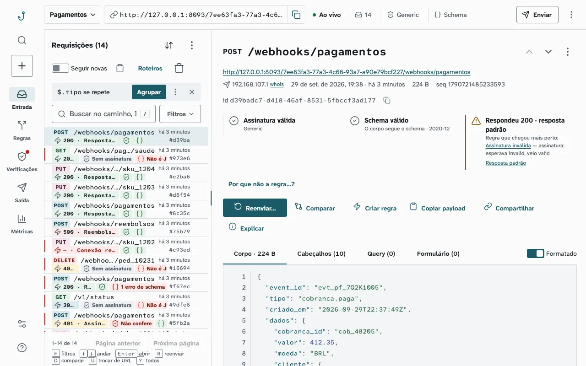
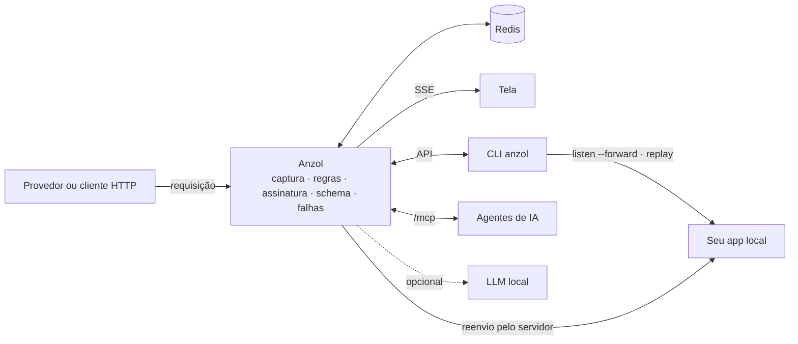
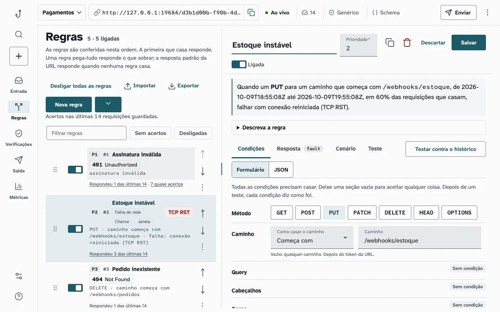
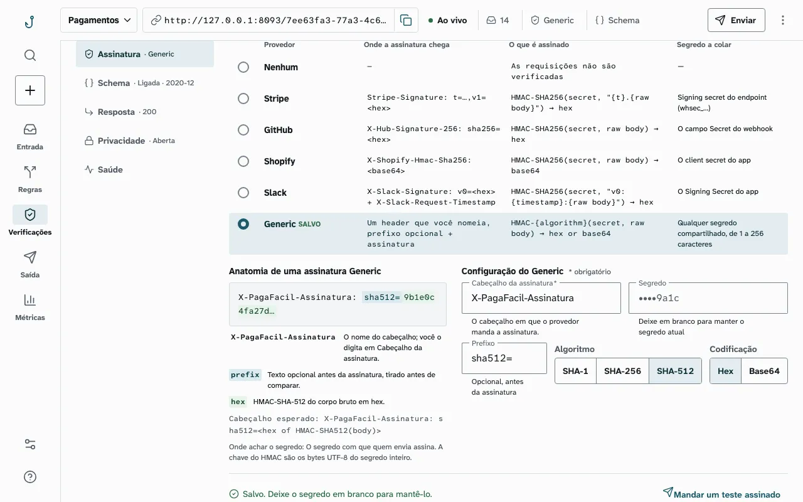
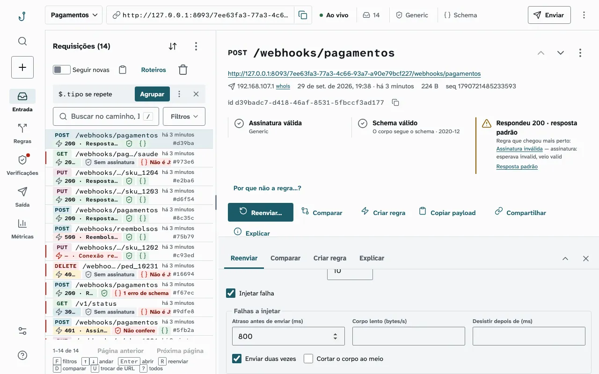
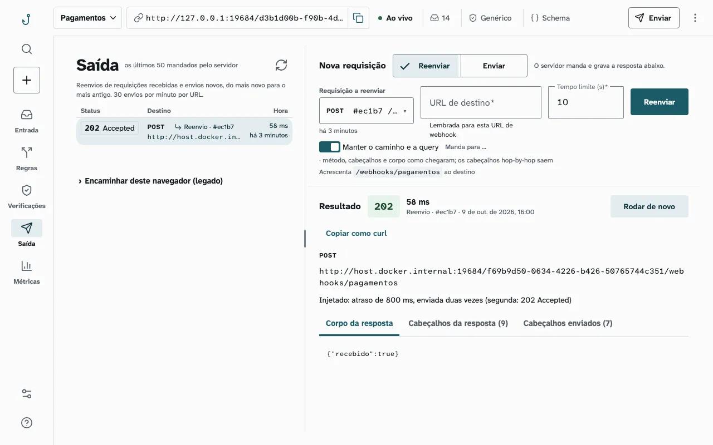
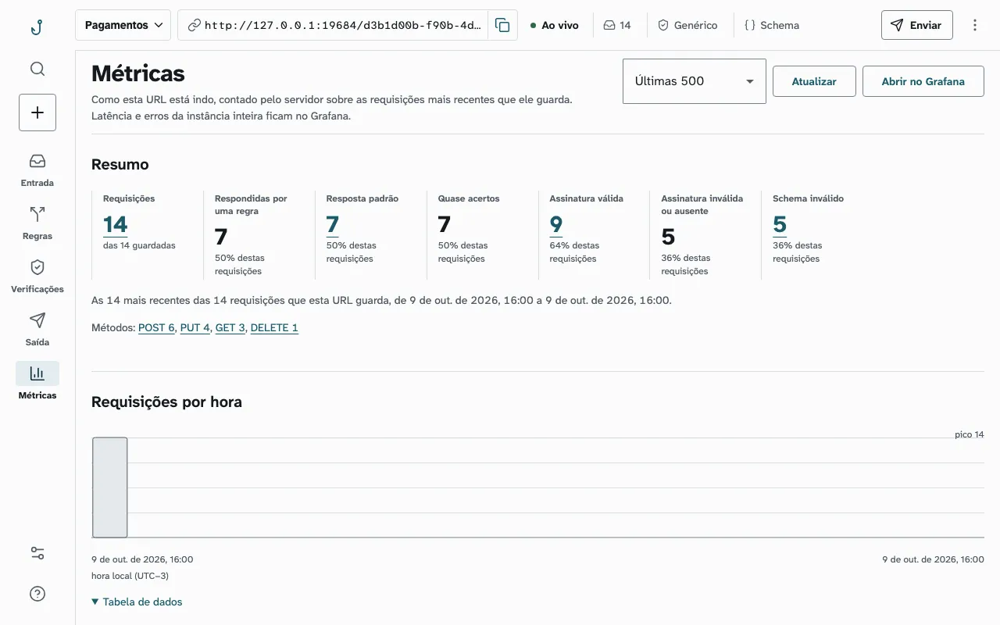
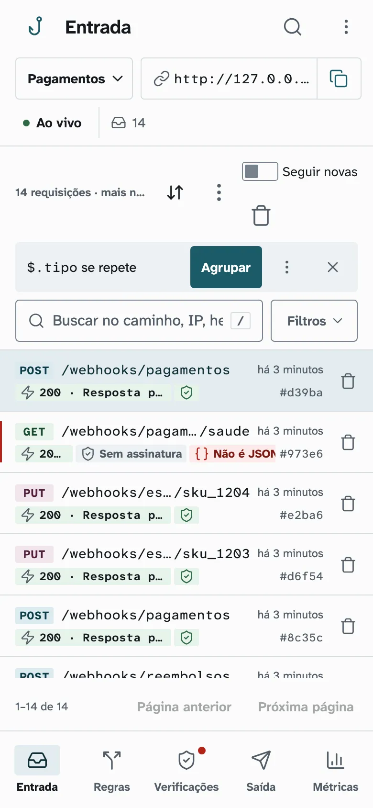

# Anzol

O Anzol gera uma URL que grava toda requisição HTTP recebida e a mostra na tela em tempo real, com regras de resposta,
verificação de assinatura e de schema e injeção de falhas. Serve para testar e depurar webhooks e clientes HTTP na sua
máquina, sem expor um servidor à internet (*anzol* é “fishhook” em português).

<picture>
  <source media="(prefers-color-scheme: dark)" srcset="docs/imagens/entrada-escuro.webp">
  
</picture>

## Como funciona



Uma imagem só: o Spring Boot (Kotlin) serve a API, o tempo real e a tela (Angular) na mesma porta, e o Redis guarda as
URLs e as mensagens.

## Início rápido

Com a imagem publicada (amd64 e arm64):

```bash
docker network create anzol
docker run -d --name anzol-db --network anzol -v anzol-db:/data redis:8.10.2-alpine \
  redis-server --maxmemory 1gb --maxmemory-policy noeviction
docker run -d --name anzol --network anzol -p 127.0.0.1:8084:8080 -e REDIS_HOST=anzol-db \
  ghcr.io/isdiegoalves/anzol:0.3.0
```

Ou a partir do repositório, com MCP, IA local e saída para a rede local já ligados:

```bash
docker compose up -d --build
```

Abra <http://localhost:8084>: a tela cria uma URL. Tudo o que chega em `http://localhost:8084/<uuid>/…` aparece na hora:

```bash
curl -X POST http://localhost:8084/<uuid>/pedidos -H 'Content-Type: application/json' -d '{"status":"pago"}'
```

As tags da imagem (`X.Y.Z`, `X.Y`, `latest`) saem a cada versão e estão em
<https://github.com/isdiegoalves/anzol/pkgs/container/anzol>. Os dados do compose ficam no volume `anzol_redis-data` e
sobrevivem a `docker compose down` (só `down -v` os apaga). Lá ficam em claro os segredos HMAC, as chaves privadas
de cifra e os valores decifrados: trate o volume e o backup como segredo.

## Funcionalidades

| O quê | Para quê | Detalhe |
|---|---|---|
| Captura em tempo real | Método, caminho, cabeçalhos, query e corpo de cada requisição, com busca e filtros | [API](docs/api.md) |
| Regras de resposta | Status, cabeçalhos e corpo por método, caminho, query, cabeçalho ou corpo; template e cenários (falha 2×, depois 200) | [Regras](docs/api.md#regras-de-resposta) |
| Injeção de falhas | Atraso, conexão reiniciada, conexão presa, corpo cortado; por sorteio (`chance`) e por janela de tempo | [Falhas](docs/api.md#atrasos-e-falhas-de-rede) |
| Verificação de assinatura | Stripe, GitHub, Shopify, Slack e HMAC genérico (SHA-1, SHA-256, SHA-512) | [Assinatura](docs/api.md#verificação-de-assinatura) |
| Validação de schema | JSON Schema 2020-12 em cada mensagem, usável nas regras | [Schema](docs/api.md#validação-de-schema) |
| Decifra de atributo (E2EE) | O servidor abre um atributo cifrado (JWE de um JWS ES256) com a chave privada da URL e guarda o valor decifrado na mensagem, atrás do segredo de leitura; chaves por URL, JWKS e o motivo de cada falha; laboratório com 27 cenários prontos, também pelo MCP | [E2EE](docs/api.md#decifra-de-atributo-e2ee) |
| Reenvio e envio pelo servidor | Reenvia uma mensagem para o seu app, com falha injetada se quiser, e guarda o histórico | [Reenvio](docs/api.md#reenvio-e-envio-pelo-servidor) |
| Esperar, buscar, estatísticas | `wait` para testes sem `sleep`; busca por texto e por condição; métricas por URL | [API](docs/api.md#esperar-por-mensagens) |
| Privacidade | Segredo de leitura por URL, links só-leitura com máscara, captura isolada por CSP | [Privacidade](docs/privacidade.md) |
| CLI `anzol` | Entrega no app local, reenvio, regras como arquivo, webhooks assinados, teste de CI num comando | [CLI](docs/cli.md) |
| MCP e IA local | Agentes operam o Anzol por MCP; regra a partir de texto e explicação da mensagem com um LLM local | [MCP e IA](docs/mcp-e-ia.md) |

<details>
<summary>Mais telas</summary>

**Regras**: a regra em palavras e o editor, aqui com uma falha de rede por sorteio e janela.

<picture>
  <source media="(prefers-color-scheme: dark)" srcset="docs/imagens/regras-escuro.webp">
  
</picture>

**Verificações**: assinatura HMAC genérica com SHA-512.

<picture>
  <source media="(prefers-color-scheme: dark)" srcset="docs/imagens/verificacoes-escuro.webp">
  
</picture>

**Reenviar com falha injetada**: atraso de 800 ms e envio em dobro.

<picture>
  <source media="(prefers-color-scheme: dark)" srcset="docs/imagens/reenviar-escuro.webp">
  
</picture>

**Saída**: o histórico do que o servidor mandou e o que foi injetado.

<picture>
  <source media="(prefers-color-scheme: dark)" srcset="docs/imagens/saida-escuro.webp">
  
</picture>

**Métricas** da URL.

<picture>
  <source media="(prefers-color-scheme: dark)" srcset="docs/imagens/metricas-escuro.webp">
  
</picture>

**No celular.**

<picture>
  <source media="(prefers-color-scheme: dark)" srcset="docs/imagens/entrada-celular-escuro.webp">
  
</picture>

</details>

## CLI

Roda em Java 21 ou mais novo (o build usa o JDK 25). Detalhes e todas as opções em [`docs/cli.md`](docs/cli.md).

```bash
(cd cli && ./gradlew installDist) && export PATH="$PWD/cli/build/install/anzol/bin:$PATH"

anzol listen --forward http://localhost:3000                        # entrega no seu app o que chega na URL
anzol replay <token> <requestId> --to http://localhost:3000          # reenvia uma mensagem gravada
anzol rules pull <token> --file regras.json                          # regras como arquivo (e rules push)
anzol send --to http://localhost:3000/webhooks/github --provider github --secret s3gredo --data-file push.json
CURSOR=$(anzol cursor <uuid>)                                        # a posição da fila, antes de disparar
anzol wait-for --token <uuid> --after "$CURSOR" --path /pedidos --timeout 10000
anzol test --method POST --path /pedidos --json-path '$.status=pago' -- ./dispara-pedido.sh {url}
```

O `anzol test` cria a URL, roda o comando que faz o seu app mandar o webhook, espera, confere e apaga a URL; a saída
diz ao CI se passou ([exemplo com GitHub Actions](docs/cli.md#anzol-test)).

## API e MCP

| Rota | O que faz |
|---|---|
| `POST /token` · `GET`/`PUT`/`DELETE /token/{id}` | Cria, lê, edita e apaga uma URL |
| `ANY /{id}[/{status}][/...]` | O webhook: grava e responde (padrão da URL ou regra) |
| `GET /token/{id}/requests` · `GET /token/{id}/stream` | Lista as mensagens · SSE a cada mensagem gravada |
| `GET`/`PUT /token/{id}/rules` | Lê ou troca as regras de resposta |
| `POST /token/{id}/requests/search` · `…/requests/wait` | Busca · espera, com prazo, a mensagem que casa |
| `POST /token/{id}/request/{rid}/replay` · `POST /token/{id}/send` | O servidor reenvia ou envia (com `chaos`, se quiser) |

Todas as rotas, os formatos e os erros estão em [`docs/api.md`](docs/api.md) e no documento OpenAPI 3.1 servido em
`/openapi.yaml` e `/openapi.json`; o contrato caixa-preta que as garante, em
[`tests/contract/README.md`](tests/contract/README.md).

### MCP

Com `ANZOL_MCP_ENABLED=true`, o app é um servidor [MCP](https://modelcontextprotocol.io) em `/mcp` com 18
ferramentas sobre a mesma API ([detalhes](docs/mcp-e-ia.md#mcp)):

```bash
claude mcp add --transport http anzol http://127.0.0.1:8084/mcp
```

### IA local

Com `ANZOL_AI_ENABLED=true`, um LLM local OpenAI-compatível sugere uma regra a partir de uma descrição e explica
por que uma mensagem deu o resultado que deu. O payload não sai da máquina, e o LLM nunca grava nada. Variáveis,
riscos e limites em [`docs/mcp-e-ia.md`](docs/mcp-e-ia.md#ia-local).

## Injeção de falhas

Do lado de quem **manda** o webhook, uma regra responde com falha:

```json
{
  "name": "instável na manutenção",
  "chance": 30,
  "active_from": "2026-09-29T09:00:00-03:00",
  "active_until": "2026-09-29T09:30:00-03:00",
  "match": { "method": ["POST"], "path": { "equals": "/pagamentos" } },
  "response": { "fault": "hang" }
}
```

`fault`: `connection_reset`, `empty_response`, `malformed_chunk`, `random_data_then_close`, `hang`,
`stall_after_headers`, `truncated_body`; ou `delay` e `dribble` para atraso e corpo lento
([detalhes](docs/api.md#atrasos-e-falhas-de-rede)).

Do lado de quem **recebe**, o CLI e o reenvio pelo servidor injetam a falha na entrega:

```bash
anzol listen --forward http://localhost:3000 --chaos-duplicate 50 --chaos-seed 7
anzol listen --forward http://localhost:3000 --chaos-delay 200..800 --chaos-abort 20 --retries 3
```

Todas as opções `--chaos-*` em [`docs/cli.md`](docs/cli.md#falhas-na-entrega-listen-e-replay).

## Configuração

| Variável (serviço `app`) | Padrão | O que faz |
|---|---|---|
| `ANZOL_MAX_REQUESTS` | `10000` | Mensagens guardadas por URL sem limpeza automática (`auto_cleanup` nulo). Ao passar, a mais antiga sai; a URL nunca para de receber. Com `auto_cleanup`, vale o limite da URL |
| `ANZOL_EXPIRY` | `604800` | Segundos até um token e suas mensagens expirarem (renovado a cada uso) |
| `ANZOL_FAULT_HOLD_MAX` | `300` | Segundos, no máximo, que as falhas `hang` e `stall_after_headers` das regras prendem a conexão; ela fecha antes se o cliente desistir |
| `ANZOL_OUTBOUND_ALLOW_PRIVATE` | `false` | Replay e send podem sair para loopback, redes privadas, CGNAT e ULA (ver [Reenvio e envio pelo servidor](docs/api.md#reenvio-e-envio-pelo-servidor)). O `docker-compose.yml` liga e por isso publica a porta só em `127.0.0.1` (`"127.0.0.1:8084:8080"`); **deixe `false` ao publicar** |
| `ANZOL_OUTBOUND_LOCALHOST_ALIAS` | vazio | Nome que substitui `localhost`/`127.0.0.1`/`::1` no alvo do replay e do send. O `docker-compose.yml` usa `host.docker.internal` (o Mac, onde roda o app local) |
| `ANZOL_MCP_ENABLED` | `false` | Servidor MCP em `/mcp` (ver [MCP](docs/mcp-e-ia.md#mcp)). O `docker-compose.yml` liga |
| `ANZOL_AI_ENABLED`, `ANZOL_AI_*` | `false` | IA local: `rules/suggest` e `explain` com um LLM OpenAI-compatível (ver [IA local](docs/mcp-e-ia.md#ia-local)). O `docker-compose.yml` liga, apontando para o oMLX do Mac |
| `ANZOL_ALLOWED_HOSTS` | `localhost,127.0.0.1,[::1],host.docker.internal` | Nomes aceitos no `Host` das rotas de gestão e do `/mcp`, contra DNS rebinding; o `Origin` dos métodos que mudam estado só passa na mesma porta do `Host` ou com `nome:porta` na lista, contra CSRF (ver [Proteção contra DNS rebinding/CSRF](docs/privacidade.md#proteção-contra-dns-rebindingcsrf)). Vazio vale o padrão. `*` desliga a conferência da gestão: **inseguro** |

Memória do Redis, observabilidade (OTLP para Grafana) e Kubernetes: [`docs/operacao.md`](docs/operacao.md) e
[`docs/helm.md`](docs/helm.md).

## Desenvolvimento

```bash
./ci.sh   # backend, CLI e frontend; depois contrato, E2E da tela e aceite do CLI num stack isolado na 8088
```

Cada parte isolada, o que o `./ci.sh` faz e os padrões de código (Kotlin e Angular):
[`docs/desenvolvimento.md`](docs/desenvolvimento.md).

| Parte | Stack | Pasta |
|---|---|---|
| API, webhook e tempo real (SSE) | Kotlin 2.4 + Spring Boot 4.1 + Java 25 | `backend/` |
| Tela | Angular 22 + Angular Material | `frontend/` |
| CLI | Kotlin 2.4 + Clikt, roda em Java 21+ | `cli/` |
| Armazenamento | Redis 8.10 | serviço `redis` do compose |
| Contrato caixa-preta da API | Playwright | `tests/contract/` |

## Apoie

Se o Anzol te ajuda:

- deixe uma ⭐ no repositório;
- abra uma [issue](https://github.com/isdiegoalves/anzol/issues) com bug, dúvida ou ideia;
- conte para quem testa webhooks;
- contribua pelo [GitHub Sponsors](https://github.com/sponsors/isdiegoalves) ou por Pix (chave `auto.isdiegoalves@gmail.com`).

## Licença

MIT, ver [`LICENSE`](LICENSE). Mantido por [Diego Alves](https://github.com/isdiegoalves).
